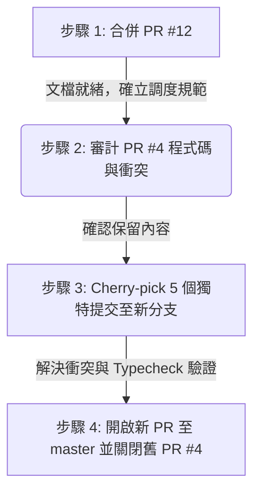

# AI-SmartBook-R2 PR #12 & PR #4 Sequencing Multi-Agent Dispatch

**日期**：2026-06-25  
**儲存庫**：`b827262-cell/AI-SmartBook-R1`  
**分支**：`docs/r2-cleanup-complete-next-phase-dispatch-20260625`  
**狀態**：`dispatch-ready`  

---

## 1. 背景與目的

在 AI-SmartBook-R2 專案清理與下一階段多代理人調度中，目前面臨兩個需要協調的 Pull Request：

1. **PR #12 (本分支 PR)**：預期將包含 R2 最終清理狀態及後續規劃的文檔分支 `docs/r2-cleanup-complete-next-phase-dispatch-20260625` 合併進 `master`。
2. **PR #4 (stale PR)**：現有的公開 PR，分支為 `feat/student-category-cover-reader-chat`，原定合併目標為 `main`。

由於 `master` 分支目前已是唯一的 Source of Truth 並且啟用了分支保護，所有代碼與文件合併必須有序進行。本文件旨在定義 **PR #12** 與 **PR #4** 的執行順序（Sequencing）與多代理人調度方案，以確保專案基底的穩定性。

---

## 2. PR 現況與衝突分析

### 2.1 PR #12 (R2 最終清理與下一階段調度文檔)
* **來源分支**：`docs/r2-cleanup-complete-next-phase-dispatch-20260625`
* **目標分支**：`master`
* **變更類型**：純文檔變更（Docs-only）
* **影響分析**：安全，無程式碼衝突，是後續所有代理人執行下一步的指引依據。

### 2.2 PR #4 (學生分類封面與讀者對話)
* **來源分支**：`origin/feat/student-category-cover-reader-chat`
* **目標分支**：`main`（錯誤的舊目標，應為 `master`）
* **獨特提交 (5 commits)**：
  1. `5d2070da` - `docs: add TUF ASUS tailscale no-reboot fallback task`
  2. `f3ed5e5e` - `docs: add TUF ASUS tailscale route repair task`
  3. `4c5cdf43` - `docs: add TUF ASUS old services shutdown task`
  4. `85152bbd` - `feat: expose institutional flow report in antiG portal`
  5. `6770122e` - `docs: add macbook student frontend runbook`
* **變更分析**：
  * 該分支與 `master` 相比，除了上述 5 個 commit 之外，其餘較早的 commit 已合入 `master`。
  * 這 5 個獨特提交包含 TUF ASUS 運維文檔及學生端 AntiG 入口/機構流頁面等代碼（涉及約 1974 行新增代碼與文件）。
  * 目前 PR #4 錯誤指向已廢棄或非主線的 `main` 分支，且與歷經 R2 大整合後的 `master` 存在極高的潛在代碼衝突風險，絕不能直接合併至 `main` 或強制 merge 到 `master`。

---

## 3. 執行順序規劃 (Sequencing Strategy)

為了保證主線 `master` 的乾淨與穩定，必須嚴格執行以下順序：



### 3.1 步驟 1：優先合併 PR #12
* **動作**：將 `docs/r2-cleanup-complete-next-phase-dispatch-20260625` 合併進 `master`，使所有後續的代理人調度計劃、剩餘分支報告及本順序表正式歸檔。
* **原因**：PR #12 為純文檔，無破壞性變更，能為下一步提供明確的工作規則。

### 3.2 步驟 2：PR #4 唯讀審計
* **動作**：代理人對 `feat/student-category-cover-reader-chat` 進行完整審計，確認這 5 個 commit 的代碼與文檔是否仍為專案所需。

### 3.3 步驟 3：移植與衝突解決
* **動作**：
  1. 基於最新已合併 PR #12 的 `master` 分支，建立全新的功能分支（例如 `feat/r2-student-category-cover-integration`）。
  2. 將 PR #4 的 5 個獨特提交逐一進行 `git cherry-pick` 到新分支。
  3. 針對代碼衝突（尤其是學生端 `App.tsx`、路由與樣式表）進行人工排解，並確保與 R2 新架構相容。

### 3.4 步驟 4：驗證與開啟新 PR
* **動作**：
  1. 在新分支執行完整建置驗證：
     ```bash
     pnpm --filter AI-adm-D1 typecheck
     pnpm --filter AI-adm-D1 build
     pnpm --filter AI-Stu-R1 typecheck
     pnpm --filter AI-Stu-R1 build
     ```
  2. 驗證無誤後，向 `master` 開啟新的 PR。
  3. 同時，關閉指向 `main` 的舊 **PR #4**，並註記：
     > "Superseded by PR #12 sequencing plan. The 5 unique commits have been cherry-picked and integrated into master via the new PR."
  4. 刪除舊的 `feat/student-category-cover-reader-chat` 遠端分支。

---

## 4. 多代理人調度分工 (Multi-Agent Assignment)

### 4.1 Agent 1 — Codex / GPT-5.5 (PR #12 執行人)
* **職責**：
  * 開啟 PR #12 將此調度文檔合入 `master`。
  * 取得 Owner 審查同意後完成合併。

### 4.2 Agent 2 — AGY / Gemini (PR #4 唯讀審計)
* **職責**：
  * 審計 `feat/student-category-cover-reader-chat` 中變更的 12 個檔案。
  * 確認 TUF ASUS 相關運維文檔及 AntiG Portal 功能在當前 R2 架構下的相容性。
  * 輸出審計報告至 `docs/r2/`。

### 4.3 Agent 3 — Claude Sonnet 4.6 (衝突解決與集成負責人)
* **職責**：
  * 執行 cherry-pick、解決程式碼衝突與整合工作。
  * 確保新分支的程式碼風格與路由設計符合 R2 模組化規範。
  * 提交集成後的驗證結果並開啟新 PR。

### 4.4 Agent 4 — Codex-5.3 Spark (基準與型別驗證)
* **職責**：
  * 針對步驟 4 產出的新分支與 `master` 進行獨立的建置與編譯驗證。

---

## 5. 終止回報範本

```md
## 終止回報 (PR #12 & PR #4 順序調度)

- **status**: success / failure / blocker / permission-halt
- **repo**: b827262-cell/AI-SmartBook-R1
- **PR #12 狀態**: 合併完成 / 待合併
- **PR #4 狀態**: 已關閉並移植 / 待處理
- **最新 master SHA**:
- **原始碼變更**: 是 / 否

### 已完成事項
1. [新增調度文件] 已建立 `docs/r2/AI-SmartBook-R2-pr12-pr4-sequencing-multi-agent-dispatch-20260625.md`。
2. ...
```
